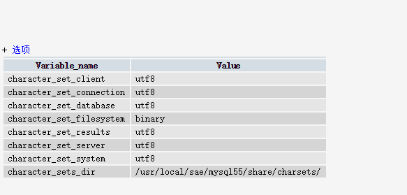
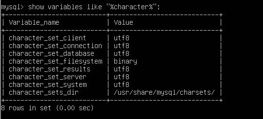
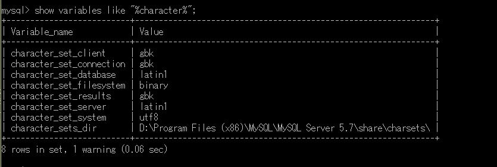
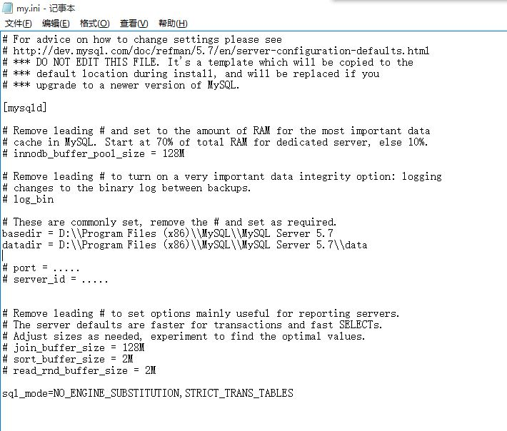
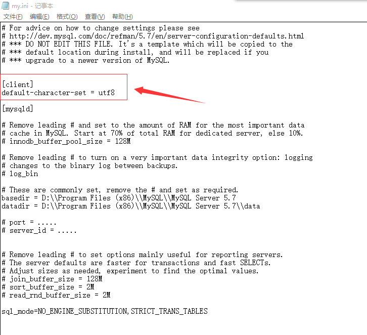
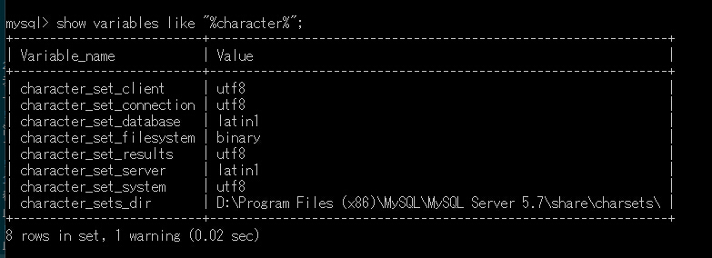
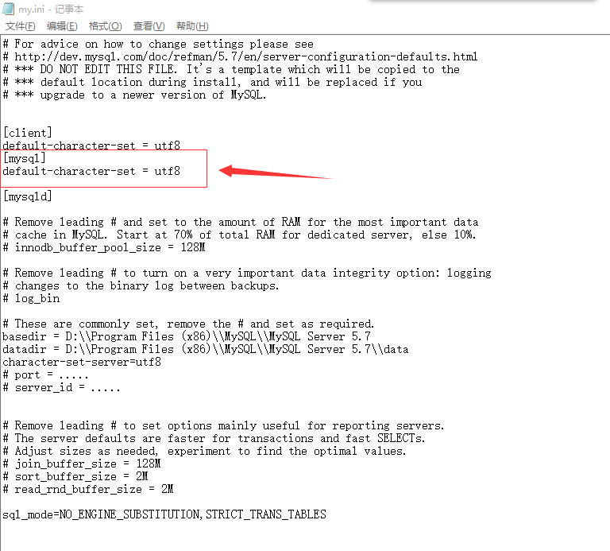
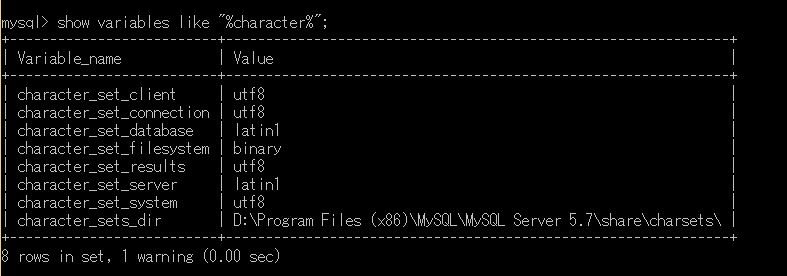
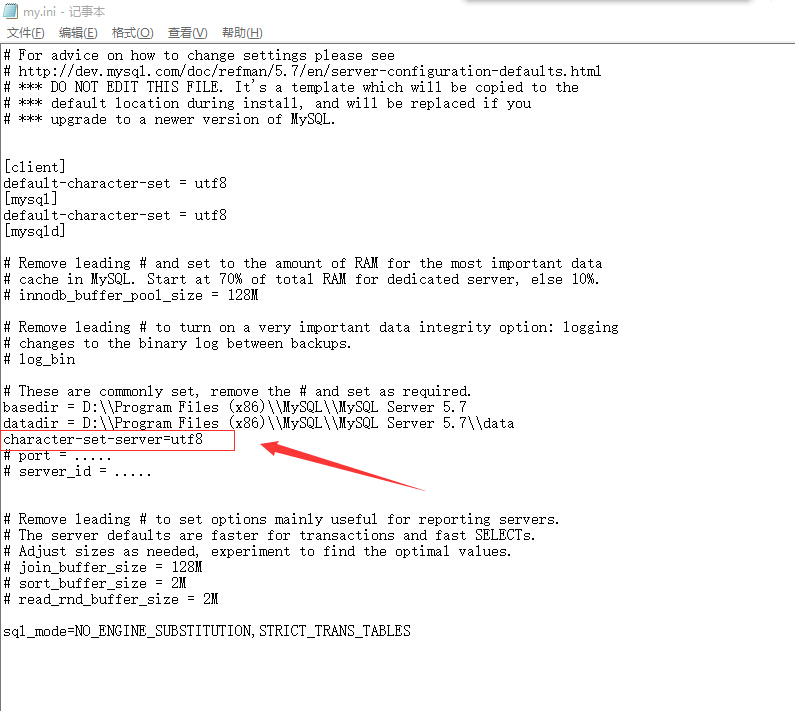
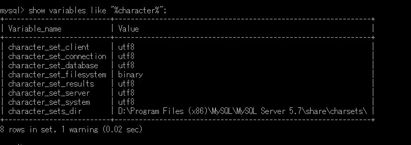

#关于PHP和MySQL

==

[TOC]

##PHP
####关于编码
######打开文件
几乎所有的编程语言打开中文文件都有很大的问题，还包括中文的输入和展示。  
`$filename = iconv(in_charset,out_charset,$filename);`这个PHP函数能够将字符串进行转码。   
首先在创建文件时，如果直接创建中文文件的话保存下的文件名也会是乱码。   
```php
<?php
$file2 = fopen("测试文档.txt", 'w');
fwrite($file2,"这是测试文件");
fclose($file2);
?>
```
这样的结果就是出来了这样的一个文件。因为我用的`sublime_text`，在这个编辑器里的文本默认编码是`utf-8`。   
   
打开文件之后中文是能够正常显示的，查看编码格式是`utf-8`看来是创建文件的时候有问题。   
```php
<?php 	
$filename = iconv('utf-8', 'gbk','测试文档.txt');
$file2 = fopen($filename, 'w');
fwrite($file2,"这是测试文件");
fclose($file2);
?>
```
只有这样的操作才能产生一个正常文件名的文件。   
   
这是iconv函数的基本用法。
`str = iconv ( string in_charset, string out_charset, string str );`  
可以看出来，在Windows上中文的默认存储格式就是GBK，那我们再来试一下打开这个文件。  
```php
<?php
$filename=iconv('utf-8','gbk',"测试文档.txt");
$file3 = fopen($filename,'r');
$content = fread($file3,filesize($filename));
echo $content;
fclose($file3);
 ?>
```
只有这样才能正常的打开文件，这是先将我们的正常的utf-8的编码格式的字符转化为GBK的才能打开文件。而且也能够正常显示出来。   
  

PHP中还有几个与编码格式有关的函数。
- mb_detect_encoding：检测字符串的编码格式.但是这个函数的结果好像不太准。
 >```php
 ><?php 
 >header("content-Type: text/html; charset=Utf-8"); 
 >$encode = "中文";
 >$result = mb_detect_encoding($encode,array('ASCII','GB2312','GBK','UTF-8','CP936'));
 >echo $result;
 >echo $encode;
 >?>
 >```
- string = mb_convert_encoding ( string str, string to_encoding [, mixed from_encoding] )
 >```php
 ><?php 
 >header("content-Type: text/html; charset=Utf-8"); 
 >$encode = "中文";
 >$result = mb_detect_encoding($encode,array('ASCII','GB2312','GBK','UTF-8','CP936'));
 >echo $result;
 >echo $encode;
 >$encode = iconv("cp936","UTF-8", $encode);
 >#$encode = mb_convert_encoding($encode,"UTF-8","CP936");
 >#$encode = mb_convert_encoding($encode,"UTF-8",array('UTF-8','ASCII','EUC-CN','CP936','BIG-5','GB2312','GBK'));
 >$result = mb_detect_encoding($encode,array('ASCII','GB2312','GBK','UTF-8','CP936'));
 >echo $result;
 >echo $encode;
 ?>
 >```
应该无论是iconv还是mb_detect_encoding都是可以正常转化的，但是不知道为什么，转化的效果并不好。

######网络传输
>"只有字母和数字[0-9a-zA-Z]、一些特殊符号"$-_.+!*'(),"[不包括双引号]、以及某些保留字，才可以不经过编码直接用于URL。"  

http协议中不支持中文编码，所以在http传输中文的时候需要先将中文进行URLencode，在服务器端接收到数据之后在URLdecode回来。  
在客户端，js用encodeURIComponent函数来进行中文转码，Python用urllib模块的urlencode来进行中文转码。但是后来我才知道，如果是浏览器上的HTML发送表单到PHP接受，中文转码是会由浏览器自动完成，可以不用转码，而如果使用Python发送中文，则需要转码。而且，GBK与utf-8的转码结果不一样，建议前端和后端代码都统一用utf-8编码格式。  
在服务器端用php的`urldecode()`来解码。   
但是在我看了一篇博客之后，发现事情更复杂了，[关于URL编码](http://www.ruanyifeng.com/blog/2010/02/url_encoding.html),这是阮一峰写的一篇关于编码格式的博客。

##MySQL
####关于编码
中文编码确实是非常蛋疼的一件事。  
在数据库里尤甚。MySQL的默认字符串集是拉丁语，真是~~  
而且，在MySQL数据库中，没有UTF-8，也没有utf-8，而是utf8.    
现在在我的电脑里的MySQL无法存入中文，类似于这样。  
  
我在数据库的表选项的编码格式里面也选择了`utf8_general_ci`然而还是没有什么用。  
在数据从PHP传到数据库的时候还专门做了转码utf-8，然而还是传不进来。  
后经高人指点，在MySQL控制台内输入`show variables like "%character%";`  
即可看到整个数据库的编码格式。  
  

- 第一行表示MySQL客户端的编码格式GBK
- 第二行表示MySQL连接时的编码格式GBK
- 第三行表示数据库**拉丁语编码**格式
- 第四行表示文件存储编码格式二进制
- 第五行表示显示结果的编码格式GBK
- 第六行表示数据库服务器端的**拉丁语编码**格式
- 第七行表示数据库所在系统的编码格式utf-8。

>除了文件存储格式二进制是对的和数据库所在的系统的编码格式，其他都是错误的吖！

正确的应该是这个样子的。


然后还有一个地方也要看一下，就像查看一下我的MySQL的`test`的数据库的`baoweichu`表单的编码格式。  
先用`use test;`找到那个数据库，然后`show create table baoweichu;`。  
就可以看到，是这个样子的。  
  
虽然下面的那个地方是写的utf-8的编码格式，不过上面的不对，在表单里面的存储编码格式还是拉丁语编码。  

正确的编码格式应该是这个样子的。  


所以只有把所有的编码格式都正确了之后，才能够在数据库里写上正确的中文。  


`utf8`，`utf-8`与`UTF-8`不是同一个意思，/(ㄒoㄒ)/~~在MySQL里是`utf8`

至于我们为什么要把编码格式都改成utf-8，因为utf-8是能够存储更多的字符，，包括全球所有的语言，是大势所趋。而GBK是中国的标准，不仅支持的汉字数量远不足utf-8，而且在几种GBK的编码方式中相互都不兼容，虽然目前的Windows操作系统中中文的默认编码格式是GBK，但是GBK编码的很多缺点已经越来越明显。  

####修复数据库编码问题

1. Linux
我是在Ubuntu下装的MySQL，使用`SHOW VARIABLES LIKE ‘character%’;`后查看的结果是这样。  
```
+--------------------------+----------------------------+
| Variable_name | Value |
+--------------------------+----------------------------+
| character_set_client | utf8 |
| character_set_connection | utf8 |
| character_set_database | latin1 |
| character_set_filesystem | binary |
| character_set_results | utf8 |
| character_set_server | latin1 |
| character_set_system | utf8 |
| character_sets_dir | /usr/share/mysql/charsets/ |
+--------------------------+----------------------------+
```
可以看到除了前面的两个是utf8与我之前在Windows下不同之外，其他的有问题的地方与在Windows下是一样的，因为Linux下没有GBK编码，默认编码格式即utf-8，所以比Windows的情况好一点。   
**解决办法**  
 1. 修改mysql的my.cnf文件中的字符集键值`sudo vim /etc/mysql/my.cnf`  
  - 在`[client]`字段中加入`default-character-set=utf8`  
  - 在`[mysqld]`字段张加入`character-set-server=utf8`  
  - 在`[mysql]`字段中加入`default-character-set=utf8`（注意，一个是mysql，一个是mysqld）  
 2. 然后再重启MySQL就可以了，但是我的MySQL在这里重启的时候出了一点问题，没有办法关掉。我就把系统重启了一下，再次进入MySQL就可以看到数据库编码已经完全恢复了正常。  
   
 3. 如果还有问题，那就是在连接的时候出了问题，在sql语句执行的最前面加上这句代码`SET NAMES ‘utf8′;`,它相当于一下三条代码。  
 ·`
  SET character_set_client = utf8;  
  SET character_set_results = utf8;  
  SET character_set_connection = utf8;  
  `
2. Windows
我也在Windows下安装了MySQL，中文编码问题非常严重，在网上找的教程有一点的问题，最终解决了。  
一开始我的数据库编码是这样的。   
  
简直惨不忍睹，各种编码格式，在网上找了教程步骤也是跟上面的一样，分别在三个地方加上设定默认编码格式就好了。  但是我的my.ini的内容是这样的，根本就没有那些字段。
  
 1. 那我们先自己加上一个字段`[client]`,并在这个的下一行加上`default-character-set = utf8`，保存看一下结果。当然，先重启MySQL。  
此时我的`my.ini`是这个样子的。   
  
此时我的MySQL是这个样子的。  
  
太棒了，多了俩utf8。  
 2.那我们在`my.ini`里面再加上一个字段`[mysql]`，并在这个的下一行加上`default-character-set = utf8`，保存看一下结果。当然先重启MySQL。  
此时我的`my.ini`是这个样子的。  
  
此时我的MySQL是这个样子的。  
  
跟之前没有什么变化嘛~  (⊙o⊙)… 没事，还有一步。
 3. 我们在`my.ini`的仅有的一个字段`[mysqld]`里面再加上这一句`character-set-server=utf8`,保存看一下结果。当然，先重启MySQL。   
此时我的`my.ini`是这个样子的。  

此时我的MySQL是这个样子的。  

完成了，哦也\\(\^o\^)/.   


>设定与数据库的连接的编码格式,这是在Linux下和Windows下通用的。
```php
mysql_query("SET NAMES 'UTF8'"); 
```


还有一些比较好的博客
[4项技巧使你不再为PHP中文编码苦恼](http://www.topthink.com/topic/7146.html)
[mysql_client_encoding](http://php.net/manual/zh/function.mysql-client-encoding.php)
[mysql_set_charset](http://php.net/manual/zh/function.mysql-set-charset.php)
[mysqli_character_set_name](http://php.net/manual/zh/mysqli.character-set-name.php)
[python2.7 查询mysql中文乱码问题](http://segmentfault.com/a/1190000000353533)
[ MySQL5中文乱码解决(Z)](http://greyshine.blog.51cto.com/1003856/301373)
[完美解决PHP中文乱码](http://blog.csdn.net/wufongming/article/details/3256186)
[PHP乱码问题，UTF-8乱码常见问题小结](http://www.jb51.net/article/30064.htm)
[怎样解决PHP中文乱码问题](http://www.lupaworld.com/forum.php?mod=viewthread&tid=148807)
[PHP输出中文乱码的问题](http://www.cnblogs.com/leandro/archive/2008/04/21/1368517.html)
[查看修改mysql编码方式](http://blog.csdn.net/daven_java/article/details/8788071)
[查看修改mysql编码方式[转载]](http://helloworlda.iteye.com/blog/1275160)
[ MySql修改数据库编码为UTF8](http://blog.csdn.net/qiyuexuelang/article/details/9049985)


##参考链接
[mb_detect_encoding](http://php.net/manual/zh/function.mb-detect-encoding.php)   
[PHP编码转换函数mb_convert_encoding与iconv的使用说明](http://kooyee.iteye.com/blog/653534)   
[PHP转码函数mb_convert_encoding与iconv的使用](http://www.91ctc.com/article/article-389.html)   
[转码函数iconv与mb_convert_encoding的区别](http://www.okajax.com/a/201106/php_iconv_mb_convert_encoding.html)   
[PHP程序中的汉字编码探讨](http://www.cnblogs.com/bandbandme/p/3154186.html)  
[（原创）Linux下MySQL 5.5的修改字符集编码为UTF8（彻底解决中文乱码问题）](http://www.ha97.com/5359.html)  
[mysql 的编码配置问题及解决方案--------windows](http://blog.csdn.net/wang9258/article/details/11968935)  
[Window下修改Mysql默认编码（改成utf8）](http://www.cnblogs.com/feichan/archive/2011/11/20/2256177.html)