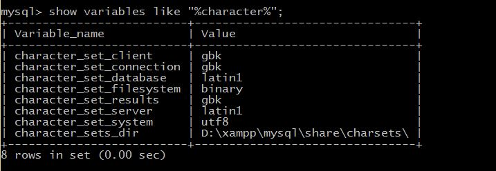
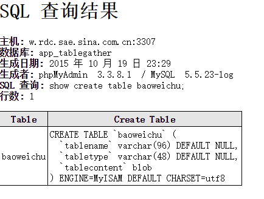

#关于PHP和MySQL

==

[TOC]

##PHP
####关于编码
######打开文件
几乎所有的编程语言打开中文文件都有很大的问题，还包括中文的输入和展示。
######网络传输
http协议中不支持中文编码，所以在http传输中文的时候需要先将中文进行URLencode，在服务器端接收到数据之后在URLdecode回来。

##MySQL
####关于编码
中文编码确实是非常蛋疼的一件事。
在数据库里尤甚。MySQL的默认字符串集是拉丁语，真是~~
现在在我的电脑里的MySQL无法存入中文，类似于这样。

我在数据库的表选项的编码格式里面也选择了`utf8_general_ci`然而还是没有什么用。
在数据从PHP传到数据库的时候还专门做了转码utf-8，然而还是传不进来。
后经高人指点，在MySQL控制台内输入`show variables like "%character%";`
即可看到整个数据库的编码格式。

这里第一行表示MySQL客户端的编码格式GBK，第二行表示MySQL连接时的编码格式GBK，第三行表示数据库**拉丁语编码**格式，第五行表示文件存储编码格式二进制，第六行表示显示结果的编码格式GBK，第七行表示数据库服务器端的编码格式**拉丁语编码**，第八行表示数据库所在系统的编码格式utf-8。

>除了文件存储格式二进制是对的和数据库所在的系统的编码格式，其他都是错误的吖！

正确的应该是这个样子的。

然后还有一个地方也要看一下，就像查看一下我的MySQL的`test`的数据库的`baoweichu`表单的编码格式。
先用`use test;`找到那个数据库，然后`show create table baoweichu;`。
就可以看到，是这个样子的。

虽然下面的那个地方是写的utf-8的编码格式，不过上面的不对，在表单里面的存储编码格式还是拉丁语编码。

正确的编码格式应该是这个样子的。

所以只有把所有的编码格式都正确了之后，才能够在数据库里写上正确的中文。

至于我们为什么要把编码格式都改成utf-8，因为utf-8是能够存储更多的字符，，包括全球所有的语言，是大势所趋。而GBK是中国的标准，不仅支持的汉字数量远不足utf-8，而且在几种GBK的编码方式中相互都不兼容，虽然目前的Windows操作系统中中文的默认编码格式是GBK，但是GBK编码的很多缺点已经越来越明显。
